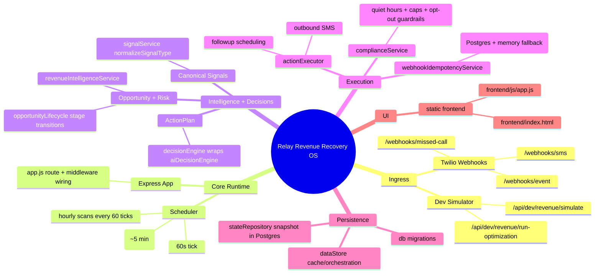
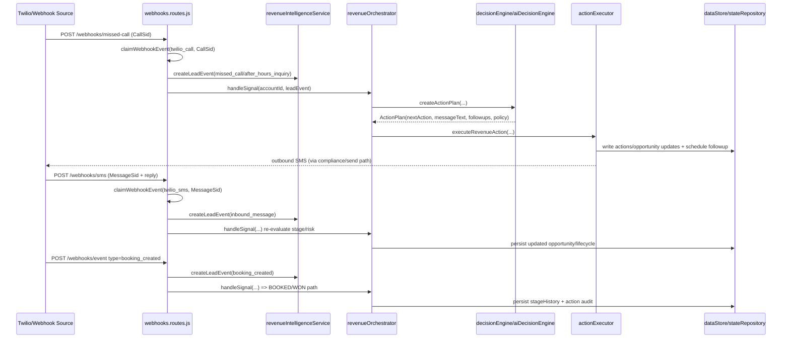

# One Page Blueprint

Governance enforcement: follow [AGENTS.md](./AGENTS.md) role constraints and block merges on [PRODUCTION_READINESS_SCORE.md](./PRODUCTION_READINESS_SCORE.md) hard gates.

## System Mindmap

## Missed Call -> SMS -> AI -> Booking

## Status Snapshot
- Done
  - Tenant-scoped Express API + static frontend wiring (`backend/src/app.js`, `frontend/index.html`).
  - Snapshot-backed Postgres persistence via in-memory store + repository (`backend/src/store/dataStore.js`, `backend/src/db/stateRepository.js`).
  - Deterministic signal -> plan -> action pipeline with lifecycle + audit (`backend/src/services/signalService.js`, `backend/src/services/decisionEngine.js`, `backend/src/services/actionExecutor.js`, `backend/src/services/opportunityLifecycle.js`).
  - Scheduler live at 60s tick; PRM loop runs every 5 ticks (`backend/src/services/scheduler.js`, `backend/src/services/passiveRevenueMonitoring.js`).
- Next
  - Continue migration from snapshot model toward fully normalized relational writes for the target entities listed in `AGENTS.md`.
  - Move in-process scheduler/work to external queue workers for horizontal scaling.
  - Expand integration test coverage beyond current security suite (`backend/test/security.integration.test.js`).
- Broken/Painful
  - In-process `setInterval` scheduler and in-memory hot state are restart-sensitive and not queue-backed.
  - Snapshot persistence centralizes writes in one large document, making partial transactional updates harder.
  - Frontend is intentionally static pre-PMF, so rich state/error handling is limited versus full SPA standards.
